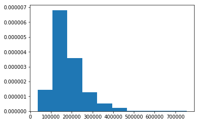
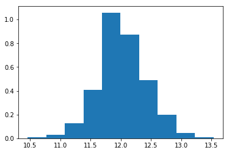

```python
import numpy as np
import pandas as pd
pd.set_option('display.max_columns', 500) 
import matplotlib.pyplot as plt

from sklearn.experimental import enable_iterative_imputer  
from sklearn.impute import IterativeImputer
from sklearn.model_selection import train_test_split
from sklearn.preprocessing import LabelEncoder, OneHotEncoder, StandardScaler, PolynomialFeatures
from sklearn import metrics
from sklearn.metrics import mean_absolute_error, r2_score, mean_squared_log_error, make_scorer, mean_squared_error
import warnings
warnings.filterwarnings("ignore")

from sklearn.neural_network import MLPRegressor, MLPClassifier
# from sknn.mlp import MultiLayerPerceptron
from sklearn.linear_model import LinearRegression, LogisticRegression, Lasso, LassoCV
from sklearn.ensemble import RandomForestRegressor, RandomForestClassifier
from sklearn.svm import SVR, SVC
from xgboost import XGBRegressor, XGBClassifier
from glmnet import ElasticNet, LogitNet
from sklearn.naive_bayes import GaussianNB
from sklearn.neighbors import KNeighborsClassifier, KNeighborsRegressor
from pygam.pygam import LinearGAM, LogisticGAM, GAM, s, f, te
# from statsmodels.gam.api import GLMGam, BSplines


from bartpy.sklearnmodel import SklearnModel


from mlens.ensemble import SuperLearner, Subsemble
from mlens.model_selection import Evaluator

from scipy.stats import randint, uniform

from autoimpute.imputations import MultipleImputer

import time 

import utils
```

    [MLENS] backend: threading


```python

```


```python
import importlib
importlib.reload(utils)
```


    <module 'utils' from '/home/mr/Downloads/kaggle-house price/utils.py'>


```python
data = pd.read_csv("./train.csv", sep=',')

test_data = pd.read_csv("./test.csv", sep=',')
test_data['SalePrice'] = -1
```


```python

```


```python
all_data = pd.concat([data, test_data], axis=0)
```


```python

```


```python
preprocess = utils.CleanIt(df=all_data, outcome='saleprice')
```


```python

```


```python
preprocess.df.describe(include=['object', 'bool', 'category'])
```


<div>
<style scoped>
    .dataframe tbody tr th:only-of-type {
        vertical-align: middle;
    }

    .dataframe tbody tr th {
        vertical-align: top;
    }

    .dataframe thead th {
        text-align: right;
    }
</style>
<table border="1" class="dataframe">
  <thead>
    <tr style="text-align: right;">
      <th></th>
      <th>mszoning</th>
      <th>street</th>
      <th>alley</th>
      <th>lotshape</th>
      <th>landcontour</th>
      <th>utilities</th>
      <th>lotconfig</th>
      <th>landslope</th>
      <th>neighborhood</th>
      <th>condition1</th>
      <th>condition2</th>
      <th>bldgtype</th>
      <th>housestyle</th>
      <th>roofstyle</th>
      <th>roofmatl</th>
      <th>exterior1st</th>
      <th>exterior2nd</th>
      <th>masvnrtype</th>
      <th>exterqual</th>
      <th>extercond</th>
      <th>foundation</th>
      <th>bsmtqual</th>
      <th>bsmtcond</th>
      <th>bsmtexposure</th>
      <th>bsmtfintype1</th>
      <th>bsmtfintype2</th>
      <th>heating</th>
      <th>heatingqc</th>
      <th>centralair</th>
      <th>electrical</th>
      <th>kitchenqual</th>
      <th>functional</th>
      <th>fireplacequ</th>
      <th>garagetype</th>
      <th>garagefinish</th>
      <th>garagequal</th>
      <th>garagecond</th>
      <th>paveddrive</th>
      <th>poolqc</th>
      <th>fence</th>
      <th>miscfeature</th>
      <th>saletype</th>
      <th>salecondition</th>
    </tr>
  </thead>
  <tbody>
    <tr>
      <th>count</th>
      <td>2915</td>
      <td>2919</td>
      <td>198</td>
      <td>2919</td>
      <td>2919</td>
      <td>2917</td>
      <td>2919</td>
      <td>2919</td>
      <td>2919</td>
      <td>2919</td>
      <td>2919</td>
      <td>2919</td>
      <td>2919</td>
      <td>2919</td>
      <td>2919</td>
      <td>2918</td>
      <td>2918</td>
      <td>2895</td>
      <td>2919</td>
      <td>2919</td>
      <td>2919</td>
      <td>2838</td>
      <td>2837</td>
      <td>2837</td>
      <td>2840</td>
      <td>2839</td>
      <td>2919</td>
      <td>2919</td>
      <td>2919</td>
      <td>2918</td>
      <td>2918</td>
      <td>2917</td>
      <td>1499</td>
      <td>2762</td>
      <td>2760</td>
      <td>2760</td>
      <td>2760</td>
      <td>2919</td>
      <td>10</td>
      <td>571</td>
      <td>105</td>
      <td>2918</td>
      <td>2919</td>
    </tr>
    <tr>
      <th>unique</th>
      <td>5</td>
      <td>2</td>
      <td>2</td>
      <td>4</td>
      <td>4</td>
      <td>2</td>
      <td>5</td>
      <td>3</td>
      <td>25</td>
      <td>9</td>
      <td>8</td>
      <td>5</td>
      <td>8</td>
      <td>6</td>
      <td>8</td>
      <td>15</td>
      <td>16</td>
      <td>4</td>
      <td>4</td>
      <td>5</td>
      <td>6</td>
      <td>4</td>
      <td>4</td>
      <td>4</td>
      <td>6</td>
      <td>6</td>
      <td>6</td>
      <td>5</td>
      <td>2</td>
      <td>5</td>
      <td>4</td>
      <td>7</td>
      <td>5</td>
      <td>6</td>
      <td>3</td>
      <td>5</td>
      <td>5</td>
      <td>3</td>
      <td>3</td>
      <td>4</td>
      <td>4</td>
      <td>9</td>
      <td>6</td>
    </tr>
    <tr>
      <th>top</th>
      <td>RL</td>
      <td>Pave</td>
      <td>Grvl</td>
      <td>Reg</td>
      <td>Lvl</td>
      <td>AllPub</td>
      <td>Inside</td>
      <td>Gtl</td>
      <td>NAmes</td>
      <td>Norm</td>
      <td>Norm</td>
      <td>1Fam</td>
      <td>1Story</td>
      <td>Gable</td>
      <td>CompShg</td>
      <td>VinylSd</td>
      <td>VinylSd</td>
      <td>None</td>
      <td>TA</td>
      <td>TA</td>
      <td>PConc</td>
      <td>TA</td>
      <td>TA</td>
      <td>No</td>
      <td>Unf</td>
      <td>Unf</td>
      <td>GasA</td>
      <td>Ex</td>
      <td>Y</td>
      <td>SBrkr</td>
      <td>TA</td>
      <td>Typ</td>
      <td>Gd</td>
      <td>Attchd</td>
      <td>Unf</td>
      <td>TA</td>
      <td>TA</td>
      <td>Y</td>
      <td>Gd</td>
      <td>MnPrv</td>
      <td>Shed</td>
      <td>WD</td>
      <td>Normal</td>
    </tr>
    <tr>
      <th>freq</th>
      <td>2265</td>
      <td>2907</td>
      <td>120</td>
      <td>1859</td>
      <td>2622</td>
      <td>2916</td>
      <td>2133</td>
      <td>2778</td>
      <td>443</td>
      <td>2511</td>
      <td>2889</td>
      <td>2425</td>
      <td>1471</td>
      <td>2310</td>
      <td>2876</td>
      <td>1025</td>
      <td>1014</td>
      <td>1742</td>
      <td>1798</td>
      <td>2538</td>
      <td>1308</td>
      <td>1283</td>
      <td>2606</td>
      <td>1904</td>
      <td>851</td>
      <td>2493</td>
      <td>2874</td>
      <td>1493</td>
      <td>2723</td>
      <td>2671</td>
      <td>1492</td>
      <td>2717</td>
      <td>744</td>
      <td>1723</td>
      <td>1230</td>
      <td>2604</td>
      <td>2654</td>
      <td>2641</td>
      <td>4</td>
      <td>329</td>
      <td>95</td>
      <td>2525</td>
      <td>2402</td>
    </tr>
  </tbody>
</table>
</div>


```python
preprocess.yyyy_mm_toDays(yyyy='yrsold', mm='mosold', output_time_var='time_to_sold', origin='20000101')

preprocess.LowercaseStringVars()
```


    <utils.CleanIt at 0x7fc272fa57b8>


```python

```


```python
counter = 0
for col in preprocess.df.columns:
    print(col, np.sum(preprocess.df[col].isna()))
    counter += 1
    if counter > 10:
        break
```

    id 0
    mssubclass 0
    mszoning 4
    lotfrontage 486
    lotarea 0
    street 0
    alley 2721
    lotshape 0
    landcontour 0
    utilities 2
    lotconfig 0


```python

```


```python
collapse_cat_dict = {

    'condition1' : [('7777', ['posa', 'posn']), ('6666', ['feedr', 'rrae', 'rran', 'rrne', 'rrnn'])], 
    'condition2' : [('7777', ['posa', 'posn']), ('6666', ['feedr', 'rrae', 'rran', 'rrne', 'rrnn'])], 
    'roofstyle' : [('7777', ['flat', 'gambrel', 'mansard', 'shed'])],
    'masvnrtype' : [('7777', ['brkcmn','none'])],
    'bsmtfullbath' : [('7777', ['2', '3'])],
    'poolqc' : [('7777', ['gd','ex','fa'])],
    'lotshape' : [('7777', ['ir1','ir2','ir3'])],
    'heatingqc' : [('7777', ['fa','po'])],	
    'poolarea' : [('7777', ['738','648','576','555','519','512','480','800','561','444','368','228','144'])],
    'housestyle' : [('7777', ['sfoyer','slvl','1.5fin']), ('6666', ['2.5fin','2story']), ('5555', ['1.5unf','2.5unf'])],
    'exterior1st' : [('8888', ['brkface','plywood','stucco']),('7777', ['cemntbd','vinylsd','wdshing']),('6666', ['hdboard','metalsd','wd']),('5555', ['stone','brkcomm','asphshn','cblock','imstucc'])],
    'exterior2nd' : [('8888', ['brk cmn','metalsd','stone','stucco','wd sdng']),('7777', ['brkface','cmentbd','vinylsd','imstucc','other']),('6666', ['hdboard','asphshn','plywood','wd shng'])],
    'foundation' : [('7777', ['brktil','slab']),('6666', ['cblock','stone','wood'])],
    'bedroomabvgr' : [('7777', ['1','2','6']),('6666', ['3','5']),('5555', ['0','4','8'])],
    'kitchenabvgr' : [('7777', ['0','2','3'])],
    'totrmsabvgrd' : [('7777', ['2','3','4']),('6666', ['7','8','14']),('5555', ['9','10','11','12'])],
    'functional' : [('7777', ['min2','min1','mod']),('6666', ['maj1','maj2','sev'])],
    'fireplaces' : [('8888', ['2','3'])],
    'saletype' : [('8888', ['cod','conld','conlw','oth']),('7777', ['cwd','con','new']),('6666', ['conli','wd'])],
    'salecondition' : [('8888', ['abnorml','family','adjland']),('7777', ['alloca','normal'])],
    'mszoning': [('8888',['fv','rl']), ('7777', ['rh','rm'])],
    }

preprocess.CollapseCategories(collapse_ratio=.0, collapse_categories_dict=collapse_cat_dict)
```


    <utils.CleanIt at 0x7fc272fa57b8>


```python

```


```python
preprocess.Nominal2Ordinal()
```


    <utils.CleanIt at 0x7fc272fa57b8>


```python

```


```python
preprocess.df.head()
```


<div>
<style scoped>
    .dataframe tbody tr th:only-of-type {
        vertical-align: middle;
    }

    .dataframe tbody tr th {
        vertical-align: top;
    }

    .dataframe thead th {
        text-align: right;
    }
</style>
<table border="1" class="dataframe">
  <thead>
    <tr style="text-align: right;">
      <th></th>
      <th>id</th>
      <th>mssubclass</th>
      <th>mszoning</th>
      <th>lotfrontage</th>
      <th>lotarea</th>
      <th>street</th>
      <th>alley</th>
      <th>lotshape</th>
      <th>landcontour</th>
      <th>utilities</th>
      <th>lotconfig</th>
      <th>landslope</th>
      <th>neighborhood</th>
      <th>condition1</th>
      <th>condition2</th>
      <th>bldgtype</th>
      <th>housestyle</th>
      <th>overallqual</th>
      <th>overallcond</th>
      <th>yearbuilt</th>
      <th>yearremodadd</th>
      <th>roofstyle</th>
      <th>roofmatl</th>
      <th>exterior1st</th>
      <th>exterior2nd</th>
      <th>masvnrtype</th>
      <th>masvnrarea</th>
      <th>exterqual</th>
      <th>extercond</th>
      <th>foundation</th>
      <th>bsmtqual</th>
      <th>bsmtcond</th>
      <th>bsmtexposure</th>
      <th>bsmtfintype1</th>
      <th>bsmtfinsf1</th>
      <th>bsmtfintype2</th>
      <th>bsmtfinsf2</th>
      <th>bsmtunfsf</th>
      <th>totalbsmtsf</th>
      <th>heating</th>
      <th>heatingqc</th>
      <th>centralair</th>
      <th>electrical</th>
      <th>1stflrsf</th>
      <th>2ndflrsf</th>
      <th>lowqualfinsf</th>
      <th>grlivarea</th>
      <th>bsmtfullbath</th>
      <th>bsmthalfbath</th>
      <th>fullbath</th>
      <th>halfbath</th>
      <th>bedroomabvgr</th>
      <th>kitchenabvgr</th>
      <th>kitchenqual</th>
      <th>totrmsabvgrd</th>
      <th>functional</th>
      <th>fireplaces</th>
      <th>fireplacequ</th>
      <th>garagetype</th>
      <th>garageyrblt</th>
      <th>garagefinish</th>
      <th>garagecars</th>
      <th>garagearea</th>
      <th>garagequal</th>
      <th>garagecond</th>
      <th>paveddrive</th>
      <th>wooddecksf</th>
      <th>openporchsf</th>
      <th>enclosedporch</th>
      <th>3ssnporch</th>
      <th>screenporch</th>
      <th>poolarea</th>
      <th>poolqc</th>
      <th>fence</th>
      <th>miscfeature</th>
      <th>miscval</th>
      <th>yrsold</th>
      <th>saletype</th>
      <th>salecondition</th>
      <th>saleprice</th>
      <th>time_to_sold</th>
    </tr>
  </thead>
  <tbody>
    <tr>
      <th>0</th>
      <td>1.0</td>
      <td>60.0</td>
      <td>1.0</td>
      <td>65.0</td>
      <td>8450.0</td>
      <td>1.0</td>
      <td>NaN</td>
      <td>1.0</td>
      <td>3.0</td>
      <td>0.0</td>
      <td>4.0</td>
      <td>0.0</td>
      <td>5.0</td>
      <td>3.0</td>
      <td>3.0</td>
      <td>0.0</td>
      <td>2.0</td>
      <td>7.0</td>
      <td>5.0</td>
      <td>2003.0</td>
      <td>2003.0</td>
      <td>1.0</td>
      <td>1.0</td>
      <td>2.0</td>
      <td>1.0</td>
      <td>1.0</td>
      <td>196.0</td>
      <td>2.0</td>
      <td>4.0</td>
      <td>2.0</td>
      <td>2.0</td>
      <td>4.0</td>
      <td>4.0</td>
      <td>2.0</td>
      <td>706.0</td>
      <td>6.0</td>
      <td>0.0</td>
      <td>150.0</td>
      <td>856.0</td>
      <td>1.0</td>
      <td>1.0</td>
      <td>1.0</td>
      <td>5.0</td>
      <td>856.0</td>
      <td>854.0</td>
      <td>0.0</td>
      <td>1710.0</td>
      <td>1.0</td>
      <td>0.0</td>
      <td>2.0</td>
      <td>1.0</td>
      <td>3.0</td>
      <td>1.0</td>
      <td>2.0</td>
      <td>12.0</td>
      <td>3.0</td>
      <td>0.0</td>
      <td>NaN</td>
      <td>1.0</td>
      <td>2003.0</td>
      <td>2.0</td>
      <td>2.0</td>
      <td>548.0</td>
      <td>5.0</td>
      <td>5.0</td>
      <td>2.0</td>
      <td>0.0</td>
      <td>61.0</td>
      <td>0.0</td>
      <td>0.0</td>
      <td>0.0</td>
      <td>0.0</td>
      <td>NaN</td>
      <td>NaN</td>
      <td>NaN</td>
      <td>0.0</td>
      <td>2008.0</td>
      <td>0.0</td>
      <td>0.0</td>
      <td>208500.0</td>
      <td>2967.0</td>
    </tr>
    <tr>
      <th>1</th>
      <td>2.0</td>
      <td>20.0</td>
      <td>1.0</td>
      <td>80.0</td>
      <td>9600.0</td>
      <td>1.0</td>
      <td>NaN</td>
      <td>1.0</td>
      <td>3.0</td>
      <td>0.0</td>
      <td>2.0</td>
      <td>0.0</td>
      <td>24.0</td>
      <td>0.0</td>
      <td>3.0</td>
      <td>0.0</td>
      <td>0.0</td>
      <td>6.0</td>
      <td>8.0</td>
      <td>1976.0</td>
      <td>1976.0</td>
      <td>1.0</td>
      <td>1.0</td>
      <td>1.0</td>
      <td>2.0</td>
      <td>0.0</td>
      <td>0.0</td>
      <td>3.0</td>
      <td>4.0</td>
      <td>0.0</td>
      <td>2.0</td>
      <td>4.0</td>
      <td>1.0</td>
      <td>0.0</td>
      <td>978.0</td>
      <td>6.0</td>
      <td>0.0</td>
      <td>284.0</td>
      <td>1262.0</td>
      <td>1.0</td>
      <td>1.0</td>
      <td>1.0</td>
      <td>5.0</td>
      <td>1262.0</td>
      <td>0.0</td>
      <td>0.0</td>
      <td>1262.0</td>
      <td>0.0</td>
      <td>1.0</td>
      <td>2.0</td>
      <td>0.0</td>
      <td>3.0</td>
      <td>1.0</td>
      <td>4.0</td>
      <td>10.0</td>
      <td>3.0</td>
      <td>1.0</td>
      <td>5.0</td>
      <td>1.0</td>
      <td>1976.0</td>
      <td>2.0</td>
      <td>2.0</td>
      <td>460.0</td>
      <td>5.0</td>
      <td>5.0</td>
      <td>2.0</td>
      <td>298.0</td>
      <td>0.0</td>
      <td>0.0</td>
      <td>0.0</td>
      <td>0.0</td>
      <td>0.0</td>
      <td>NaN</td>
      <td>NaN</td>
      <td>NaN</td>
      <td>0.0</td>
      <td>2007.0</td>
      <td>0.0</td>
      <td>0.0</td>
      <td>181500.0</td>
      <td>2691.0</td>
    </tr>
    <tr>
      <th>2</th>
      <td>3.0</td>
      <td>60.0</td>
      <td>1.0</td>
      <td>68.0</td>
      <td>11250.0</td>
      <td>1.0</td>
      <td>NaN</td>
      <td>0.0</td>
      <td>3.0</td>
      <td>0.0</td>
      <td>4.0</td>
      <td>0.0</td>
      <td>5.0</td>
      <td>3.0</td>
      <td>3.0</td>
      <td>0.0</td>
      <td>2.0</td>
      <td>7.0</td>
      <td>5.0</td>
      <td>2001.0</td>
      <td>2002.0</td>
      <td>1.0</td>
      <td>1.0</td>
      <td>2.0</td>
      <td>1.0</td>
      <td>1.0</td>
      <td>162.0</td>
      <td>2.0</td>
      <td>4.0</td>
      <td>2.0</td>
      <td>2.0</td>
      <td>4.0</td>
      <td>2.0</td>
      <td>2.0</td>
      <td>486.0</td>
      <td>6.0</td>
      <td>0.0</td>
      <td>434.0</td>
      <td>920.0</td>
      <td>1.0</td>
      <td>1.0</td>
      <td>1.0</td>
      <td>5.0</td>
      <td>920.0</td>
      <td>866.0</td>
      <td>0.0</td>
      <td>1786.0</td>
      <td>1.0</td>
      <td>0.0</td>
      <td>2.0</td>
      <td>1.0</td>
      <td>3.0</td>
      <td>1.0</td>
      <td>2.0</td>
      <td>10.0</td>
      <td>3.0</td>
      <td>1.0</td>
      <td>5.0</td>
      <td>1.0</td>
      <td>2001.0</td>
      <td>2.0</td>
      <td>2.0</td>
      <td>608.0</td>
      <td>5.0</td>
      <td>5.0</td>
      <td>2.0</td>
      <td>0.0</td>
      <td>42.0</td>
      <td>0.0</td>
      <td>0.0</td>
      <td>0.0</td>
      <td>0.0</td>
      <td>NaN</td>
      <td>NaN</td>
      <td>NaN</td>
      <td>0.0</td>
      <td>2008.0</td>
      <td>0.0</td>
      <td>0.0</td>
      <td>223500.0</td>
      <td>3180.0</td>
    </tr>
    <tr>
      <th>3</th>
      <td>4.0</td>
      <td>70.0</td>
      <td>1.0</td>
      <td>60.0</td>
      <td>9550.0</td>
      <td>1.0</td>
      <td>NaN</td>
      <td>0.0</td>
      <td>3.0</td>
      <td>0.0</td>
      <td>0.0</td>
      <td>0.0</td>
      <td>6.0</td>
      <td>3.0</td>
      <td>3.0</td>
      <td>0.0</td>
      <td>2.0</td>
      <td>7.0</td>
      <td>5.0</td>
      <td>1915.0</td>
      <td>1970.0</td>
      <td>1.0</td>
      <td>1.0</td>
      <td>6.0</td>
      <td>0.0</td>
      <td>0.0</td>
      <td>0.0</td>
      <td>3.0</td>
      <td>4.0</td>
      <td>1.0</td>
      <td>4.0</td>
      <td>1.0</td>
      <td>4.0</td>
      <td>0.0</td>
      <td>216.0</td>
      <td>6.0</td>
      <td>0.0</td>
      <td>540.0</td>
      <td>756.0</td>
      <td>1.0</td>
      <td>2.0</td>
      <td>1.0</td>
      <td>5.0</td>
      <td>961.0</td>
      <td>756.0</td>
      <td>0.0</td>
      <td>1717.0</td>
      <td>1.0</td>
      <td>0.0</td>
      <td>1.0</td>
      <td>0.0</td>
      <td>3.0</td>
      <td>1.0</td>
      <td>2.0</td>
      <td>11.0</td>
      <td>3.0</td>
      <td>1.0</td>
      <td>2.0</td>
      <td>5.0</td>
      <td>1998.0</td>
      <td>3.0</td>
      <td>3.0</td>
      <td>642.0</td>
      <td>5.0</td>
      <td>5.0</td>
      <td>2.0</td>
      <td>0.0</td>
      <td>35.0</td>
      <td>272.0</td>
      <td>0.0</td>
      <td>0.0</td>
      <td>0.0</td>
      <td>NaN</td>
      <td>NaN</td>
      <td>NaN</td>
      <td>0.0</td>
      <td>2006.0</td>
      <td>0.0</td>
      <td>1.0</td>
      <td>140000.0</td>
      <td>2237.0</td>
    </tr>
    <tr>
      <th>4</th>
      <td>5.0</td>
      <td>60.0</td>
      <td>1.0</td>
      <td>84.0</td>
      <td>14260.0</td>
      <td>1.0</td>
      <td>NaN</td>
      <td>0.0</td>
      <td>3.0</td>
      <td>0.0</td>
      <td>2.0</td>
      <td>0.0</td>
      <td>13.0</td>
      <td>3.0</td>
      <td>3.0</td>
      <td>0.0</td>
      <td>2.0</td>
      <td>8.0</td>
      <td>5.0</td>
      <td>2000.0</td>
      <td>2000.0</td>
      <td>1.0</td>
      <td>1.0</td>
      <td>2.0</td>
      <td>1.0</td>
      <td>1.0</td>
      <td>350.0</td>
      <td>2.0</td>
      <td>4.0</td>
      <td>2.0</td>
      <td>2.0</td>
      <td>4.0</td>
      <td>0.0</td>
      <td>2.0</td>
      <td>655.0</td>
      <td>6.0</td>
      <td>0.0</td>
      <td>490.0</td>
      <td>1145.0</td>
      <td>1.0</td>
      <td>1.0</td>
      <td>1.0</td>
      <td>5.0</td>
      <td>1145.0</td>
      <td>1053.0</td>
      <td>0.0</td>
      <td>2198.0</td>
      <td>1.0</td>
      <td>0.0</td>
      <td>2.0</td>
      <td>1.0</td>
      <td>4.0</td>
      <td>1.0</td>
      <td>2.0</td>
      <td>13.0</td>
      <td>3.0</td>
      <td>1.0</td>
      <td>5.0</td>
      <td>1.0</td>
      <td>2000.0</td>
      <td>2.0</td>
      <td>3.0</td>
      <td>836.0</td>
      <td>5.0</td>
      <td>5.0</td>
      <td>2.0</td>
      <td>192.0</td>
      <td>84.0</td>
      <td>0.0</td>
      <td>0.0</td>
      <td>0.0</td>
      <td>0.0</td>
      <td>NaN</td>
      <td>NaN</td>
      <td>NaN</td>
      <td>0.0</td>
      <td>2008.0</td>
      <td>0.0</td>
      <td>0.0</td>
      <td>250000.0</td>
      <td>3271.0</td>
    </tr>
  </tbody>
</table>
</div>


```python
counter = 0
for col in preprocess.df.columns:
    print(col, np.sum(preprocess.df[col].isna()))
    counter += 1
    if counter > 10:
        break
```

    id 0
    mssubclass 0
    mszoning 4
    lotfrontage 486
    lotarea 0
    street 0
    alley 2721
    lotshape 0
    landcontour 0
    utilities 2
    lotconfig 0


```python
to_delete = ['alley', 'poolqc', 'fence', 'miscfeature', 'fireplacequ']
preprocess.DropIt(to_delete)
```


    <utils.CleanIt at 0x7fc272fa57b8>


```python
preprocess.df.head()
```


<div>
<style scoped>
    .dataframe tbody tr th:only-of-type {
        vertical-align: middle;
    }

    .dataframe tbody tr th {
        vertical-align: top;
    }

    .dataframe thead th {
        text-align: right;
    }
</style>
<table border="1" class="dataframe">
  <thead>
    <tr style="text-align: right;">
      <th></th>
      <th>id</th>
      <th>mssubclass</th>
      <th>mszoning</th>
      <th>lotfrontage</th>
      <th>lotarea</th>
      <th>street</th>
      <th>lotshape</th>
      <th>landcontour</th>
      <th>utilities</th>
      <th>lotconfig</th>
      <th>landslope</th>
      <th>neighborhood</th>
      <th>condition1</th>
      <th>condition2</th>
      <th>bldgtype</th>
      <th>housestyle</th>
      <th>overallqual</th>
      <th>overallcond</th>
      <th>yearbuilt</th>
      <th>yearremodadd</th>
      <th>roofstyle</th>
      <th>roofmatl</th>
      <th>exterior1st</th>
      <th>exterior2nd</th>
      <th>masvnrtype</th>
      <th>masvnrarea</th>
      <th>exterqual</th>
      <th>extercond</th>
      <th>foundation</th>
      <th>bsmtqual</th>
      <th>bsmtcond</th>
      <th>bsmtexposure</th>
      <th>bsmtfintype1</th>
      <th>bsmtfinsf1</th>
      <th>bsmtfintype2</th>
      <th>bsmtfinsf2</th>
      <th>bsmtunfsf</th>
      <th>totalbsmtsf</th>
      <th>heating</th>
      <th>heatingqc</th>
      <th>centralair</th>
      <th>electrical</th>
      <th>1stflrsf</th>
      <th>2ndflrsf</th>
      <th>lowqualfinsf</th>
      <th>grlivarea</th>
      <th>bsmtfullbath</th>
      <th>bsmthalfbath</th>
      <th>fullbath</th>
      <th>halfbath</th>
      <th>bedroomabvgr</th>
      <th>kitchenabvgr</th>
      <th>kitchenqual</th>
      <th>totrmsabvgrd</th>
      <th>functional</th>
      <th>fireplaces</th>
      <th>garagetype</th>
      <th>garageyrblt</th>
      <th>garagefinish</th>
      <th>garagecars</th>
      <th>garagearea</th>
      <th>garagequal</th>
      <th>garagecond</th>
      <th>paveddrive</th>
      <th>wooddecksf</th>
      <th>openporchsf</th>
      <th>enclosedporch</th>
      <th>3ssnporch</th>
      <th>screenporch</th>
      <th>poolarea</th>
      <th>miscval</th>
      <th>yrsold</th>
      <th>saletype</th>
      <th>salecondition</th>
      <th>saleprice</th>
      <th>time_to_sold</th>
    </tr>
  </thead>
  <tbody>
    <tr>
      <th>0</th>
      <td>1.0</td>
      <td>60.0</td>
      <td>1.0</td>
      <td>65.0</td>
      <td>8450.0</td>
      <td>1.0</td>
      <td>1.0</td>
      <td>3.0</td>
      <td>0.0</td>
      <td>4.0</td>
      <td>0.0</td>
      <td>5.0</td>
      <td>3.0</td>
      <td>3.0</td>
      <td>0.0</td>
      <td>2.0</td>
      <td>7.0</td>
      <td>5.0</td>
      <td>2003.0</td>
      <td>2003.0</td>
      <td>1.0</td>
      <td>1.0</td>
      <td>2.0</td>
      <td>1.0</td>
      <td>1.0</td>
      <td>196.0</td>
      <td>2.0</td>
      <td>4.0</td>
      <td>2.0</td>
      <td>2.0</td>
      <td>4.0</td>
      <td>4.0</td>
      <td>2.0</td>
      <td>706.0</td>
      <td>6.0</td>
      <td>0.0</td>
      <td>150.0</td>
      <td>856.0</td>
      <td>1.0</td>
      <td>1.0</td>
      <td>1.0</td>
      <td>5.0</td>
      <td>856.0</td>
      <td>854.0</td>
      <td>0.0</td>
      <td>1710.0</td>
      <td>1.0</td>
      <td>0.0</td>
      <td>2.0</td>
      <td>1.0</td>
      <td>3.0</td>
      <td>1.0</td>
      <td>2.0</td>
      <td>12.0</td>
      <td>3.0</td>
      <td>0.0</td>
      <td>1.0</td>
      <td>2003.0</td>
      <td>2.0</td>
      <td>2.0</td>
      <td>548.0</td>
      <td>5.0</td>
      <td>5.0</td>
      <td>2.0</td>
      <td>0.0</td>
      <td>61.0</td>
      <td>0.0</td>
      <td>0.0</td>
      <td>0.0</td>
      <td>0.0</td>
      <td>0.0</td>
      <td>2008.0</td>
      <td>0.0</td>
      <td>0.0</td>
      <td>208500.0</td>
      <td>2967.0</td>
    </tr>
    <tr>
      <th>1</th>
      <td>2.0</td>
      <td>20.0</td>
      <td>1.0</td>
      <td>80.0</td>
      <td>9600.0</td>
      <td>1.0</td>
      <td>1.0</td>
      <td>3.0</td>
      <td>0.0</td>
      <td>2.0</td>
      <td>0.0</td>
      <td>24.0</td>
      <td>0.0</td>
      <td>3.0</td>
      <td>0.0</td>
      <td>0.0</td>
      <td>6.0</td>
      <td>8.0</td>
      <td>1976.0</td>
      <td>1976.0</td>
      <td>1.0</td>
      <td>1.0</td>
      <td>1.0</td>
      <td>2.0</td>
      <td>0.0</td>
      <td>0.0</td>
      <td>3.0</td>
      <td>4.0</td>
      <td>0.0</td>
      <td>2.0</td>
      <td>4.0</td>
      <td>1.0</td>
      <td>0.0</td>
      <td>978.0</td>
      <td>6.0</td>
      <td>0.0</td>
      <td>284.0</td>
      <td>1262.0</td>
      <td>1.0</td>
      <td>1.0</td>
      <td>1.0</td>
      <td>5.0</td>
      <td>1262.0</td>
      <td>0.0</td>
      <td>0.0</td>
      <td>1262.0</td>
      <td>0.0</td>
      <td>1.0</td>
      <td>2.0</td>
      <td>0.0</td>
      <td>3.0</td>
      <td>1.0</td>
      <td>4.0</td>
      <td>10.0</td>
      <td>3.0</td>
      <td>1.0</td>
      <td>1.0</td>
      <td>1976.0</td>
      <td>2.0</td>
      <td>2.0</td>
      <td>460.0</td>
      <td>5.0</td>
      <td>5.0</td>
      <td>2.0</td>
      <td>298.0</td>
      <td>0.0</td>
      <td>0.0</td>
      <td>0.0</td>
      <td>0.0</td>
      <td>0.0</td>
      <td>0.0</td>
      <td>2007.0</td>
      <td>0.0</td>
      <td>0.0</td>
      <td>181500.0</td>
      <td>2691.0</td>
    </tr>
    <tr>
      <th>2</th>
      <td>3.0</td>
      <td>60.0</td>
      <td>1.0</td>
      <td>68.0</td>
      <td>11250.0</td>
      <td>1.0</td>
      <td>0.0</td>
      <td>3.0</td>
      <td>0.0</td>
      <td>4.0</td>
      <td>0.0</td>
      <td>5.0</td>
      <td>3.0</td>
      <td>3.0</td>
      <td>0.0</td>
      <td>2.0</td>
      <td>7.0</td>
      <td>5.0</td>
      <td>2001.0</td>
      <td>2002.0</td>
      <td>1.0</td>
      <td>1.0</td>
      <td>2.0</td>
      <td>1.0</td>
      <td>1.0</td>
      <td>162.0</td>
      <td>2.0</td>
      <td>4.0</td>
      <td>2.0</td>
      <td>2.0</td>
      <td>4.0</td>
      <td>2.0</td>
      <td>2.0</td>
      <td>486.0</td>
      <td>6.0</td>
      <td>0.0</td>
      <td>434.0</td>
      <td>920.0</td>
      <td>1.0</td>
      <td>1.0</td>
      <td>1.0</td>
      <td>5.0</td>
      <td>920.0</td>
      <td>866.0</td>
      <td>0.0</td>
      <td>1786.0</td>
      <td>1.0</td>
      <td>0.0</td>
      <td>2.0</td>
      <td>1.0</td>
      <td>3.0</td>
      <td>1.0</td>
      <td>2.0</td>
      <td>10.0</td>
      <td>3.0</td>
      <td>1.0</td>
      <td>1.0</td>
      <td>2001.0</td>
      <td>2.0</td>
      <td>2.0</td>
      <td>608.0</td>
      <td>5.0</td>
      <td>5.0</td>
      <td>2.0</td>
      <td>0.0</td>
      <td>42.0</td>
      <td>0.0</td>
      <td>0.0</td>
      <td>0.0</td>
      <td>0.0</td>
      <td>0.0</td>
      <td>2008.0</td>
      <td>0.0</td>
      <td>0.0</td>
      <td>223500.0</td>
      <td>3180.0</td>
    </tr>
    <tr>
      <th>3</th>
      <td>4.0</td>
      <td>70.0</td>
      <td>1.0</td>
      <td>60.0</td>
      <td>9550.0</td>
      <td>1.0</td>
      <td>0.0</td>
      <td>3.0</td>
      <td>0.0</td>
      <td>0.0</td>
      <td>0.0</td>
      <td>6.0</td>
      <td>3.0</td>
      <td>3.0</td>
      <td>0.0</td>
      <td>2.0</td>
      <td>7.0</td>
      <td>5.0</td>
      <td>1915.0</td>
      <td>1970.0</td>
      <td>1.0</td>
      <td>1.0</td>
      <td>6.0</td>
      <td>0.0</td>
      <td>0.0</td>
      <td>0.0</td>
      <td>3.0</td>
      <td>4.0</td>
      <td>1.0</td>
      <td>4.0</td>
      <td>1.0</td>
      <td>4.0</td>
      <td>0.0</td>
      <td>216.0</td>
      <td>6.0</td>
      <td>0.0</td>
      <td>540.0</td>
      <td>756.0</td>
      <td>1.0</td>
      <td>2.0</td>
      <td>1.0</td>
      <td>5.0</td>
      <td>961.0</td>
      <td>756.0</td>
      <td>0.0</td>
      <td>1717.0</td>
      <td>1.0</td>
      <td>0.0</td>
      <td>1.0</td>
      <td>0.0</td>
      <td>3.0</td>
      <td>1.0</td>
      <td>2.0</td>
      <td>11.0</td>
      <td>3.0</td>
      <td>1.0</td>
      <td>5.0</td>
      <td>1998.0</td>
      <td>3.0</td>
      <td>3.0</td>
      <td>642.0</td>
      <td>5.0</td>
      <td>5.0</td>
      <td>2.0</td>
      <td>0.0</td>
      <td>35.0</td>
      <td>272.0</td>
      <td>0.0</td>
      <td>0.0</td>
      <td>0.0</td>
      <td>0.0</td>
      <td>2006.0</td>
      <td>0.0</td>
      <td>1.0</td>
      <td>140000.0</td>
      <td>2237.0</td>
    </tr>
    <tr>
      <th>4</th>
      <td>5.0</td>
      <td>60.0</td>
      <td>1.0</td>
      <td>84.0</td>
      <td>14260.0</td>
      <td>1.0</td>
      <td>0.0</td>
      <td>3.0</td>
      <td>0.0</td>
      <td>2.0</td>
      <td>0.0</td>
      <td>13.0</td>
      <td>3.0</td>
      <td>3.0</td>
      <td>0.0</td>
      <td>2.0</td>
      <td>8.0</td>
      <td>5.0</td>
      <td>2000.0</td>
      <td>2000.0</td>
      <td>1.0</td>
      <td>1.0</td>
      <td>2.0</td>
      <td>1.0</td>
      <td>1.0</td>
      <td>350.0</td>
      <td>2.0</td>
      <td>4.0</td>
      <td>2.0</td>
      <td>2.0</td>
      <td>4.0</td>
      <td>0.0</td>
      <td>2.0</td>
      <td>655.0</td>
      <td>6.0</td>
      <td>0.0</td>
      <td>490.0</td>
      <td>1145.0</td>
      <td>1.0</td>
      <td>1.0</td>
      <td>1.0</td>
      <td>5.0</td>
      <td>1145.0</td>
      <td>1053.0</td>
      <td>0.0</td>
      <td>2198.0</td>
      <td>1.0</td>
      <td>0.0</td>
      <td>2.0</td>
      <td>1.0</td>
      <td>4.0</td>
      <td>1.0</td>
      <td>2.0</td>
      <td>13.0</td>
      <td>3.0</td>
      <td>1.0</td>
      <td>1.0</td>
      <td>2000.0</td>
      <td>2.0</td>
      <td>3.0</td>
      <td>836.0</td>
      <td>5.0</td>
      <td>5.0</td>
      <td>2.0</td>
      <td>192.0</td>
      <td>84.0</td>
      <td>0.0</td>
      <td>0.0</td>
      <td>0.0</td>
      <td>0.0</td>
      <td>0.0</td>
      <td>2008.0</td>
      <td>0.0</td>
      <td>0.0</td>
      <td>250000.0</td>
      <td>3271.0</td>
    </tr>
  </tbody>
</table>
</div>


Impute the the missing values in the continuous variables:


```python
preprocess.HandleMissing(missing='impute', exclude_cols=['saleprice', 'id']+preprocess.categorical_vars,seed=123456)
```


    <utils.CleanIt at 0x7fc272fa57b8>


```python
counter = 0
for col in preprocess.df.columns:
    miss_count = np.sum(preprocess.df[col].isna())
    if miss_count >= 1:
        print(col, miss_count)
        counter += 1
        if counter > 10:
            break
```

    mszoning 4
    utilities 2
    exterior1st 1
    exterior2nd 1
    masvnrtype 24
    bsmtqual 81
    bsmtcond 82
    bsmtexposure 82
    bsmtfintype1 79
    bsmtfintype2 80
    electrical 1


Fill in the missing values in categoical variables with a value:


```python
preprocess.HandleMissing(missing='fill', exclude_cols=['saleprice', 'id']+preprocess.continuous_vars, fill_nan_value=9999, seed=123456)
```


    <utils.CleanIt at 0x7fc272fa57b8>


```python
counter = 0
for col in preprocess.df.columns:
    miss_count = np.sum(preprocess.df[col].isna())
    if miss_count >= 1:
        print(col, miss_count)
        counter += 1
        if counter > 10:
            break
```


```python

```


```python

```


```python
cat_dict_numeric = {
    'yearbuilt': [1930, 1950, 1985],
    'yearremodadd': [1970, 1980, 1990, 2005],
    'yrsold' : [2007]
}
preprocess.CategorizeIt(categories_dict=cat_dict_numeric, prefix='cat_')

```


    <utils.CleanIt at 0x7fc272fa57b8>


```python

```


```python
exter = ['exterqual', 'extercond']
bsmtqual = ['bsmtqual', 'bsmtcond']
bsmtfin = ['bsmtfintype1','bsmtfintype2']
bsmtbath = ['bsmtfullbath', 'bsmthalfbath']
bath = ['fullbath', 'halfbath']
kitchen = ['kitchenabvgr', 'kitchenqual']
garage = ['garagecond', 'garagequal']
vars_dict = {'exter':exter,'bsmtqual':bsmtqual,'bsmtfin':bsmtfin,'bsmtbath':bsmtbath,'bath':bath,'kitchen':kitchen,'garage':garage}

preprocess.AddSummations(vars_dict=vars_dict, keep_old_vars=False, prefix='sum_')
```


    <utils.CleanIt at 0x7fc272fa57b8>


```python

```


```python

```


```python
to_binarize = [cols for cols in ['sum_' + col for col, _ in vars_dict.items()] + [col for col, _ in collapse_cat_dict.items()] + ['cat_'+col for col, _ in cat_dict_numeric.items()] if cols in preprocess.df.columns]

preprocess.DummyIt(tobinarize=to_binarize, include_old_cols=False, DropLowVarDummyThreshold=.1)
```


    <utils.CleanIt at 0x7fc272fa57b8>


```python
preprocess.df.shape
```


    (2919, 86)


```python

```


```python
important_original_inputs = [col for col in preprocess.df.columns]

preprocess.AddInteractions(degree=2, interaction_only=False, include_bias=False, exclude_cols=['saleprice', 'id'], DropLowVarInteractionsThreshold=.05)
```


```python

```


```python
index2keep4lassoSelect = [col for col in preprocess.df.columns]

test_data_cleaned = preprocess.df.iloc[np.where(preprocess.df['saleprice'] == -1.)[0], :][index2keep4lassoSelect].copy()

preprocess.df = preprocess.df.iloc[np.where(preprocess.df['saleprice'] != -1.)[0], :].copy()
```


```python

```


```python
all_important_vars = [col for col in index2keep4lassoSelect if col not in ['saleprice', 'id']]#[col for col in set((important_original_inputs + important_interactions)) if col not in ['saleprice', 'id']]

new_df_x = preprocess.df[all_important_vars].copy()
y = preprocess.df['saleprice']
```


```python

```


```python
train_x, test_x, train_y, test_y, scaleIt = utils.SplitIt(df_x=new_df_x, y=y, exclude_cols=['id'], standardizeIt=True, train_size=.8, seed=123)
train_x, test_x, train_y, test_y = np.array(train_x), np.array(test_x), np.array(train_y).reshape(-1, 1), np.array(test_y).reshape(-1, 1)
```


```python

```


```python
plt.hist(train_y, density=True)
plt.show()
```





```python
plt.hist(np.log(train_y), density=True)
plt.show()
```





```python
train_x.shape
```


    (1168, 115)


```python

```


```python

```


```python
test_data_cleaned1 = utils.ScaleTestData(scaleIt, test_x_data=test_data_cleaned[all_important_vars])

test_data_cleaned1 = np.array(test_data_cleaned1)
```


```python

```


```python
ests = [
        # ('convex', Lasso(fit_intercept=False, positive=True)),
        # ('lasso', ElasticNet(n_splits=5, scoring='mean_squared_error')), 
        # ('knn', KNeighborsClassifier()), 
        ('xgb', XGBRegressor(subsample=.7, n_jobs=4, bootstrap=True)),
        # ('rf', RandomForestRegressor(max_features='sqrt', random_state=1234, n_jobs=4)),
        # ('svm', SVR(kernel='poly', shrinking=True)),
        # ('nn', MLPRegressor(activation='relu', solver='adam', learning_rate='adaptive', max_iter=200, shuffle=False, random_state=12345))
        ]

params = {
            # 'convex': {'alpha': uniform(.0, 1.)},
            # 'lasso': {'alpha': uniform(.0, .9)},
            # 'knn': {'n_neighbors': randint(5, 20)},
            'xgb': {'n_estimators': randint(200, 2000), 'min_split_loss': randint(2, 8), 'max_depth': randint(2, 7), 'learning_rate': uniform(0.01, 0.1), 'reg_lambda': uniform(.1, .5), 'reg_alpha': uniform(.2, .8)},
            # 'rf' : {'n_estimators': randint(700, 1500), 'max_depth':randint(8, 15), 'min_samples_split':randint(8, 15), 'min_samples_leaf':randint(2, 5)},
            # 'svm': {'C': uniform(0., 100.), 'gamma': uniform(0., 1.), 'degree': randint(2, 5), 'coef0': uniform(0.5, 2.)},
            # 'nn': {'hidden_layer_sizes': (randint(10, 100), randint(10, 100), randint(10, 100)), 'alpha': uniform(.001, 0.1), 'learning_rate_init': uniform(.001, 0.1)}
        }

```


```python

```


```python

```


```python
accuracy_scorer = make_scorer(mean_squared_log_error, greater_is_better=False)

evaluator = Evaluator(accuracy_scorer, cv=10, random_state=12345, verbose=1)
evaluator.fit(train_x, train_y, ests, params, n_iter=10)
```

    Launching job
    Job           done | 00:01:09


    <mlens.model_selection.model_selection.Evaluator at 0x7fc22af14eb8>


```python

```


```python
pd.options.display.max_colwidth = 1000
results_hyperp = pd.DataFrame(evaluator.results)
print("Score comparison with best params founds:\n")
results_hyperp[[cols for cols in results_hyperp if 'score' in cols or 'param' in cols]]
```

    Score comparison with best params founds:
    


<div>
<style scoped>
    .dataframe tbody tr th:only-of-type {
        vertical-align: middle;
    }

    .dataframe tbody tr th {
        vertical-align: top;
    }

    .dataframe thead th {
        text-align: right;
    }
</style>
<table border="1" class="dataframe">
  <thead>
    <tr style="text-align: right;">
      <th></th>
      <th>test_score-m</th>
      <th>test_score-s</th>
      <th>train_score-m</th>
      <th>train_score-s</th>
      <th>params</th>
    </tr>
  </thead>
  <tbody>
    <tr>
      <th>xgb</th>
      <td>-0.017699</td>
      <td>0.004257</td>
      <td>-0.000479</td>
      <td>0.000015</td>
      <td>{'n_estimators': 1709, 'min_split_loss': 7, 'max_depth': 3, 'learning_rate': 0.04163755545817859, 'reg_lambda': 0.25818777729089293, 'reg_alpha': 0.45310044366542873}</td>
    </tr>
  </tbody>
</table>
</div>


```python

```


```python

```


```python

```


```python

```


```python

```


```python
linreg = [LinearRegression()]
linregL1L2 = [ElasticNet(alpha=alf, n_splits=5, random_state=123, n_jobs=3) for alf in [0, .25, .5, .75, 1]]
rf = [RandomForestRegressor(n_estimators=nest, max_features='sqrt', max_depth=mx, random_state=1234, n_jobs=3) for nest in [50, 100, 200] for mx in [2, 4, 6]]
xgb = [XGBRegressor(n_estimators=n_est,max_depth=mx, min_split_loss=gm, learning_rate=et, reg_lambda=lmb, reg_alpha=alf, subsample=.7, n_jobs=3) for n_est in [100, 400, 800] for mx in [4, 6, 8] for gm in [2, 4, 6] for et in [0.01, .02, 0.05] for lmb in [.3, .5, .7] for alf in [.3, .5, .7]]
svm = [SVR(C=c, gamma=gm) for c in [10, 100] for gm in [0.0001, 0.1]]
knn = [KNeighborsRegressor(n_neighbors=neighb) for neighb in [2, 10, 15]]
convex = [Lasso(alpha=.001, fit_intercept=False, positive=True)]
gam = [GAM(n_splines=4)]
bart = [SklearnModel(n_samples=ns, n_burn=nb, n_trees=nt, store_in_sample_predictions=False) for ns in [10] for nb in [20] for nt in [10]]
nn = [MLPRegressor(hidden_layer_sizes=(50, 20, 50), activation='relu', solver='adam', alpha=0.1, learning_rate='adaptive', learning_rate_init=0.01, max_iter=200, shuffle=False, random_state=12345)]
```


```python

```


```python
ensemble = SuperLearner(folds=30, scorer=mean_squared_log_error, random_state=1234, n_jobs=3)
ensemble.add(linreg + linregL1L2 + xgb + knn )
# ensemble.add(linregL1L2 + xgb + knn )
# ensemble.add(knn + xgb)

ensemble.add_meta(convex[0])
```


```python

```


```python
ensemble.fit(train_x, train_y)
```


```python

```


```python
results = pd.DataFrame(ensemble.data)

results1 = results.sort_values(by=['score-m'], ascending=False).astype(str)

train_preds = ensemble.predict(train_x)
print(np.sqrt(mean_squared_log_error(train_preds, train_y)))


test_preds = ensemble.predict(test_x[:150, :])
print(np.sqrt(mean_squared_log_error(test_preds, test_y[:150])))

```


```python

```


```python

plt.hist(test_y, density=True)
plt.show()

plt.hist(test_preds, density=True)
plt.show()
```


```python

```


```python

```


```python

```


```python

```


```python

```


```python

```
